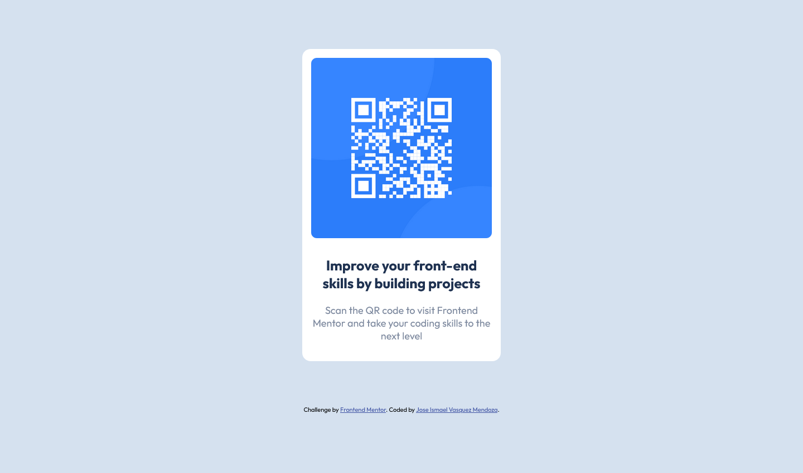

# Frontend Mentor - QR code component solution

This is a solution to the [QR code component challenge on Frontend Mentor](https://www.frontendmentor.io/challenges/qr-code-component-iux_sIO_H). Frontend Mentor challenges help you improve your coding skills by building realistic projects. 

## Table of contents

- [Overview](#overview)
  - [Screenshot](#screenshot)
  - [Links](#links)
- [My process](#my-process)
  - [Built with](#built-with)
  - [Continued development](#continued-development)
  - [Useful resources](#useful-resources)
- [Author](#author)

## Overview

### Screenshot

#### Desktop view

#### Mobile view

### Links

- Solution URL: [Live Code](https://your-solution-url.com)
- Live Site URL: [QR code component solution glitch](https://qr-code-component-solution.glitch.me)

## My process

### Built with

- Semantic HTML5 markup
- CSS custom properties
- Flexbox

### Continued development

Getting to feel more comfortable about building websites with flexbox 

### Useful resources

- [A Guide to Flexbox](https://css-tricks.com/snippets/css/a-guide-to-flexbox/) - This helped me understand flexbox properties. I really liked this pattern and will use it going forward.

## Author

<!-- - Website - [Add your name here](https://www.your-site.com) -->
- Frontend Mentor - [@leamsi-ciber](https://www.frontendmentor.io/profile/leamsi-ciber)
- Twitter - [@leamsixthaboy](https://www.twitter.com/leamsixthaboy)

